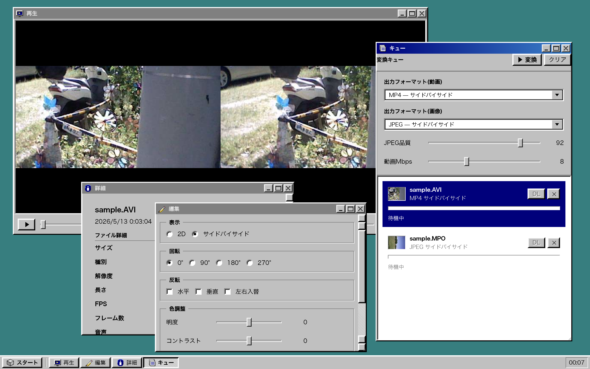

# 3DS 3D Media Studio

ニンテンドー3DSで撮影した **3D動画 (.AVI)** と **3D写真 (.MPO)** をブラウザで再生・変換・編集できる、シンプルな静的サイト。

## 機能

- **読み込み**: D&D で `.AVI` / `.MPO` を複数同時投入
- **プレビュー**: 2D / SBS(サイドバイサイド)切替で再生・表示
- **変換キュー**: 複数ファイルをまとめて変換、進捗表示、個別ダウンロード
- **出力フォーマット**:
  - 動画: MP4 (H.264 + AAC) — 2D左/右、SBS、Top/Bottom、アナグリフ赤青
  - 画像: JPEG または MPO 再パック(同上の3Dモード対応)
- **調整(per file)**: 回転 (0/90/180/270°) / 反転 / 左右入替 / 明度 / コントラスト / 彩度 / ガンマ / 色相
- **共通設定(queue-wide)**: 出力フォーマット / JPEG品質 / 動画ビットレート
- **EXIF 編集**: 日時 / Make / Model / Software / 説明 / 作者 / 著作権 / 向き / GPS
  3DS固有の MakerNote (Parallax / Model ID 等) は読み取り専用で表示・保持

## 3DS フォーマット概要

### `.AVI` (3DS 3D動画)
- RIFF AVI 1.0、3 ストリーム: MJPEG 左目 + ADPCM IMA 音声 + MJPEG 右目
- 480×240/eye、20fps、ADPCM IMA mono 16kHz
- ストリームタグ: `00dc`(左映像)/ `01wb`(音声)/ `02dc`(右映像)

### `.MPO` (3DS 3D写真)
- CIPA DC-007 MPO: JPEG×2 連結 + 1枚目に MPF (Multi-Picture Format) APP2 マーカー
- 640×480/eye、各 sRGB JPEG
- 3DS固有 MakerNote に Parallax 等
